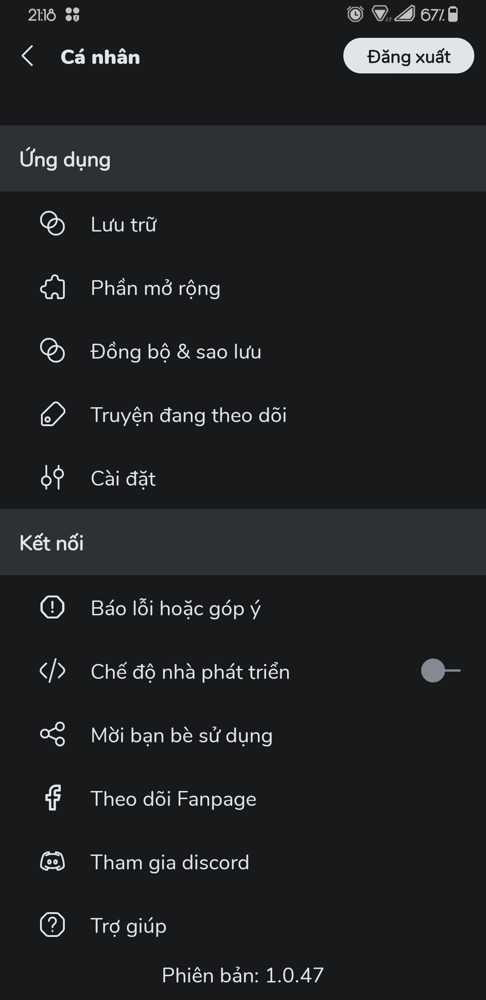
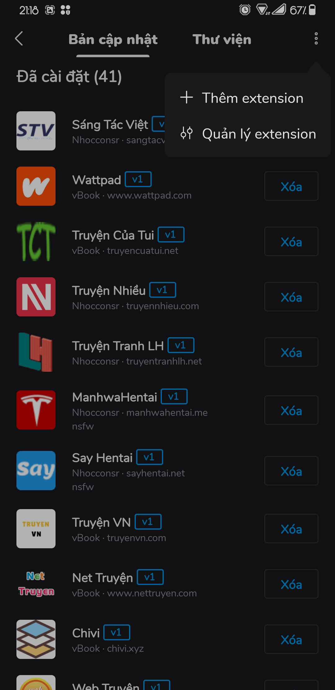

<!-- filepath: c:\Users\Long\Desktop\vbook-extensions\README.md -->
## Vbook Extensions

Extensions cho app Vbook App.

Tải app tại : [Vbook App Download](https://bit.ly/vbookapp)

## Danh sách Extensions

| STT | Tên Extension | Loại | Ngôn ngữ | Website | Version |
|-----|---------------|------|----------|---------|---------|
| 1 | TVTruyen | Novel | Tiếng Việt | [tvtruyen.com](https://www.tvtruyen.com) | v1 |
| 2 | akaytruyen | Novel | Tiếng Việt | [akaytruyen.com](https://akaytruyen.com/) | v1 |
| 3 | conduongbachu | Novel | Tiếng Việt | [akaytruyen.com](https://akaytruyen.com/) | v2 |
| 4 | metruyenchu | Novel | Tiếng Việt | [metruyenchu.com](https://metruyenchu.com) | v1 |
| 5 | doctruyen14 | Novel | Tiếng Việt | [doctruyen14.vip](https://doctruyen14.vip/) | v2 |
| 6 | banlong | Novel | Tiếng Việt | [banlong.vip](https://banlong.vip/) | v2 |
| 7 | 69shuba | Novel | Tiếng Trung | [69shuba.com](https://www.69shuba.com/) | v1 |
| 8 | AliceSW | Novel | Tiếng Trung | [alicesw.com](https://www.alicesw.com/) | v1 |
| 9 | lxmanga | Comic | Tiếng Việt | [lxmanga.blog](https://lxmanga.blog/) | v1 |
| 10 | HentaiVN | Comic | Tiếng Việt | [hentaihvn.tv](https://hentaihvn.tv) | v1 |

**Tổng cộng:** 10 extensions

## Link extension

https://raw.githubusercontent.com/longvuu/ext/refs/heads/master/plugin.json

## Hướng dẫn cài đặt

| 1.Mở phần mở rộng trong app                   | 2.Lựa chọn quản lý Extension URL        |
| --------------------------------------------- | --------------------------------------- |
| | |
* Sau đó nhập link: